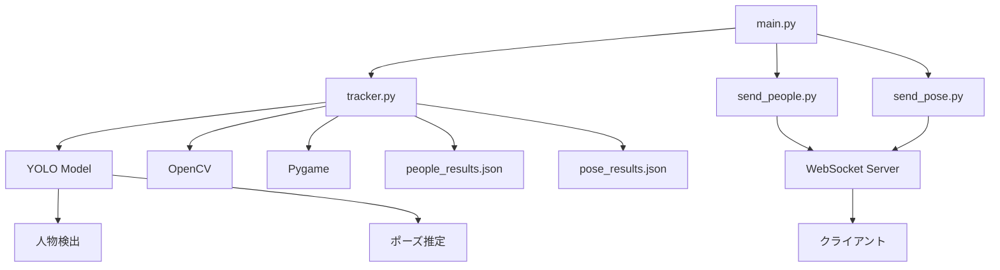

# YOLOStream

YOLOStream は、リアルタイムで人物検出とポーズ推定を行い、その結果を WebSocket を通じて送信するシステムです。

## システム構成



## モジュール説明

### main.py

- システムのエントリーポイント
- 各モジュールの起動と管理を行う
- コマンドライン引数の処理
- 仮想環境の Python インタープリタのパス設定

### tracker.py

- YOLO モデルを使用した人物検出とポーズ推定
- OpenCV を使用したカメラ/動画のキャプチャ
- 検出結果の JSON ファイルへの保存
- キャラクター更新時の音声再生（Pygame）

### send_people.py

- WebSocket サーバー（ポート 8765）
- people_results.json の内容をリアルタイムでクライアントに送信

### send_pose.py

- WebSocket サーバー（ポート 8080）
- pose_results.json の内容をリアルタイムでクライアントに送信

## 依存関係

- Python 3.8+
- ultralytics (YOLO)
- OpenCV
- Pygame
- websockets

## 使用方法

1. 仮想環境の作成と依存関係のインストール

```bash
python -m venv myenv
source myenv/bin/activate  # Windows: myenv\Scripts\activate
pip install -r requirements.txt
```

2. システムの起動

```bash
python main.py [オプション]
```

### オプション

- `--address`: サーバーアドレス（デフォルト: localhost）
- `--mirrored`: 映像を左右反転
- `--gpu`: YOLO を GPU モードで実行
- `--video`: 入力動画ファイルのパス
- `--camera`: カメラデバイス番号（デフォルト: 0）

## 出力ファイル

- `people_results.json`: 人物検出結果
- `pose_results.json`: ポーズ推定結果
